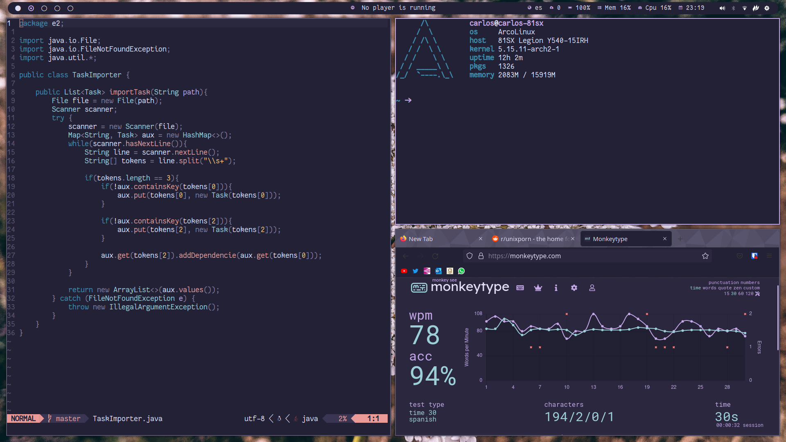

# Dotfiles

This repository contains my personal dotfiles, feel free to copy anything you find interesting 😀.

## Stow

I use stow to easily manage my dotfiles and restore my dotfiles. The weird folder structure of
the repo helps restoring the files in new installations , you can just run `stow <appname>` and it
will symlink the dotfiles to its correct location.

## Aesthetic

- 🎨Theme: Rosé Pine Moon
- 🔤Font: Fantasque Sans Nerd Font
- 📄Fetch: pfetch
- 🌸[Wallpaper](https://github.com/rose-pine/wallpapers/blob/main/flower.jpg)

## Apps

- 💻 Terminal: [alacritty](./alacritty/.config/alacritty/alacritty.yml)
- 🐚 Shell: [zsh](./zsh/.zshrc)
- 🚀 Shell prompt: [starship](./starship/.config/starship.toml)
- ⌨️ Editor: [neovim](./nvim/.config/nvim/)
